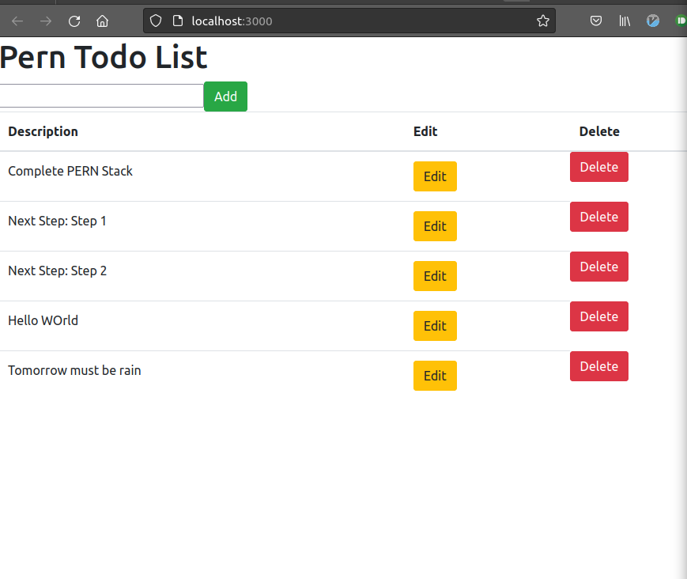

# Creating Client-Server-Database Architecture using PERN (TODO WebAPP)
1. This Project Uses PostgresSQL, NodeJS, Express and ReactJS.
2. This Project is to build a TODO List , with features of adding, deleting and updating.



## Requirements 
* Node
* PostgresSQL

### Postgres Installation
Repository Cofig:

```
sudo sh -c 'echo "deb http://apt.postgresql.org/pub/repos/apt $(lsb_release -cs)-pgdg main" > /etc/apt/sources.list.d/pgdg.list'
```

Signing Key:
```
wget --quiet -O - https://www.postgresql.org/media/keys/ACCC4CF8.asc | sudo apt-key add -
```

Installation Command:

```
sudo apt-get -y install postgresql
```

### Postgres Build for Todo WebApp

Entry Point(as user postgres):

```
psql -U postgres
```

### Creating a Database:
```
createdb -Upostgres perntodo
make run-migrations
```

Then Enter the Data using INSERT command!

## Cloning the repository 
Clone the repository using git commands.

## Building the Application:
```
make setup
```

## Running the Project :
Starting server ,get into server in shell and run to start server:
```
make start-server
```

Starting client ,get into server in shell and run to start client:
```
make start-client
```


